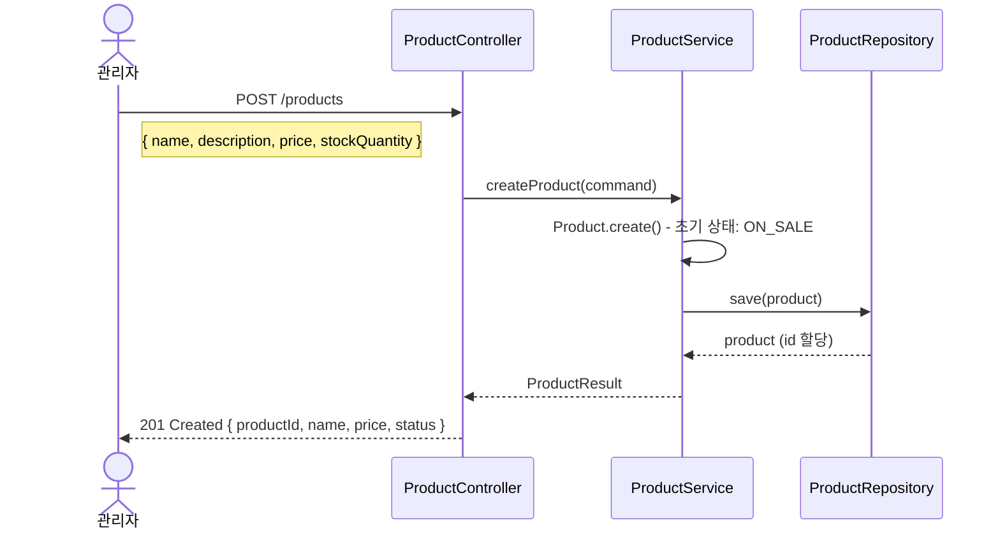
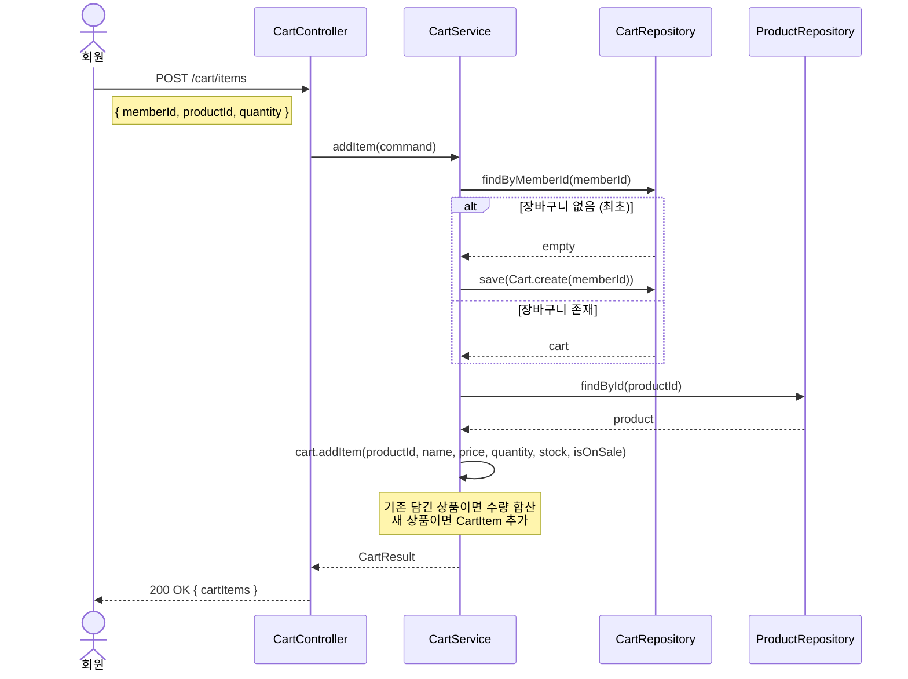
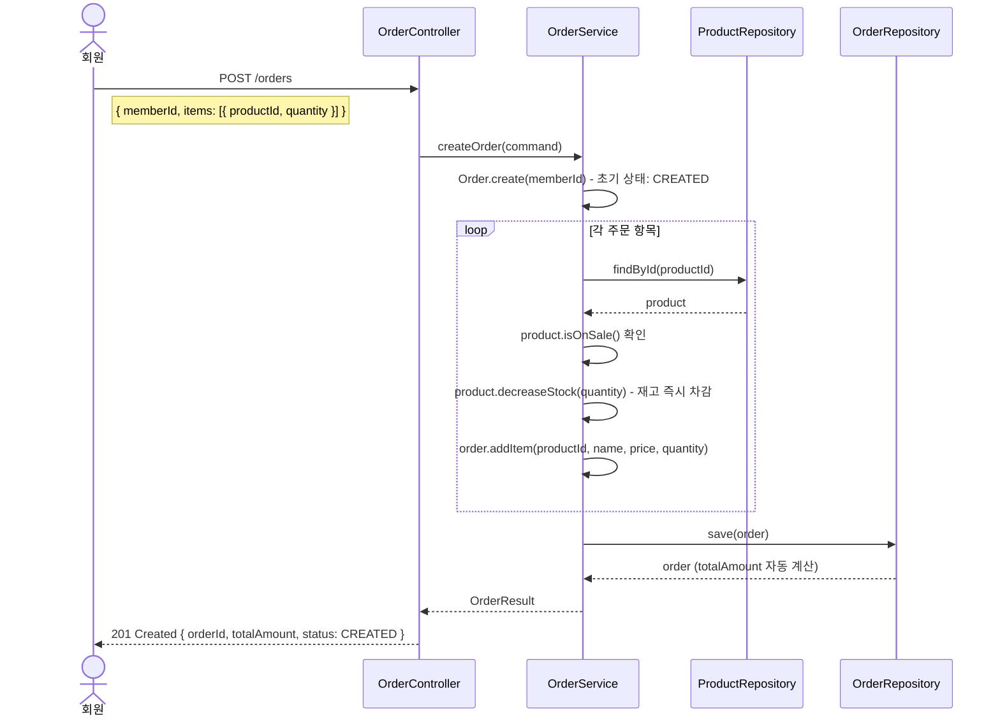
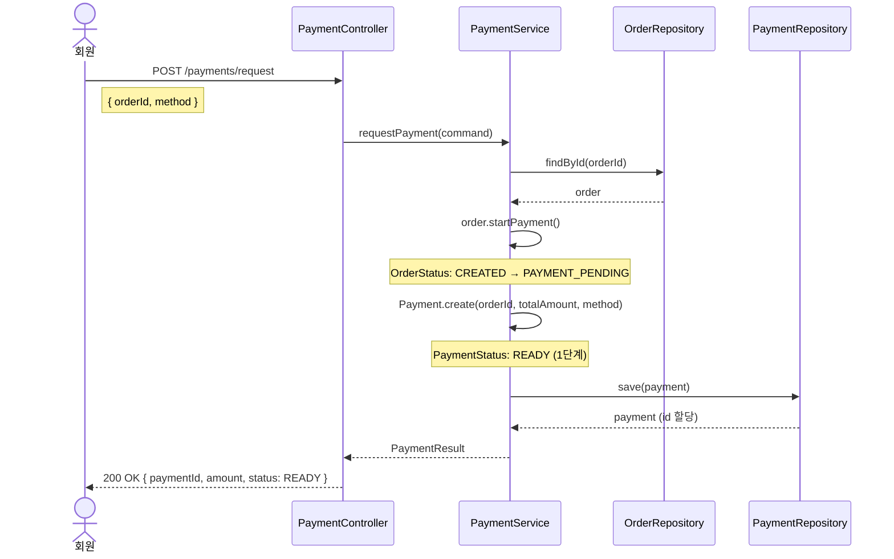
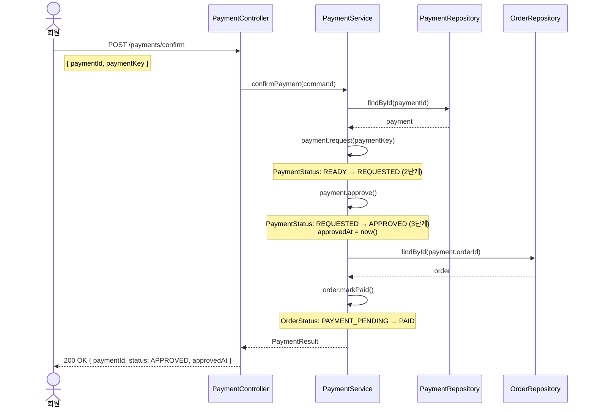
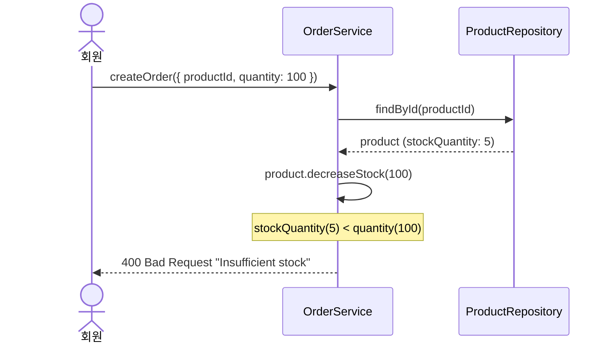
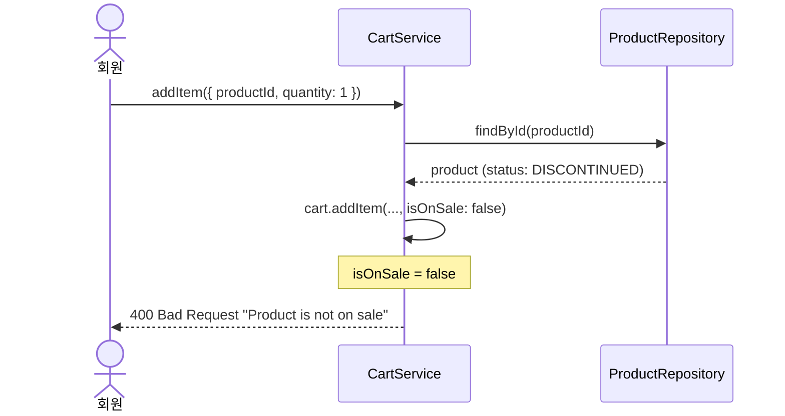
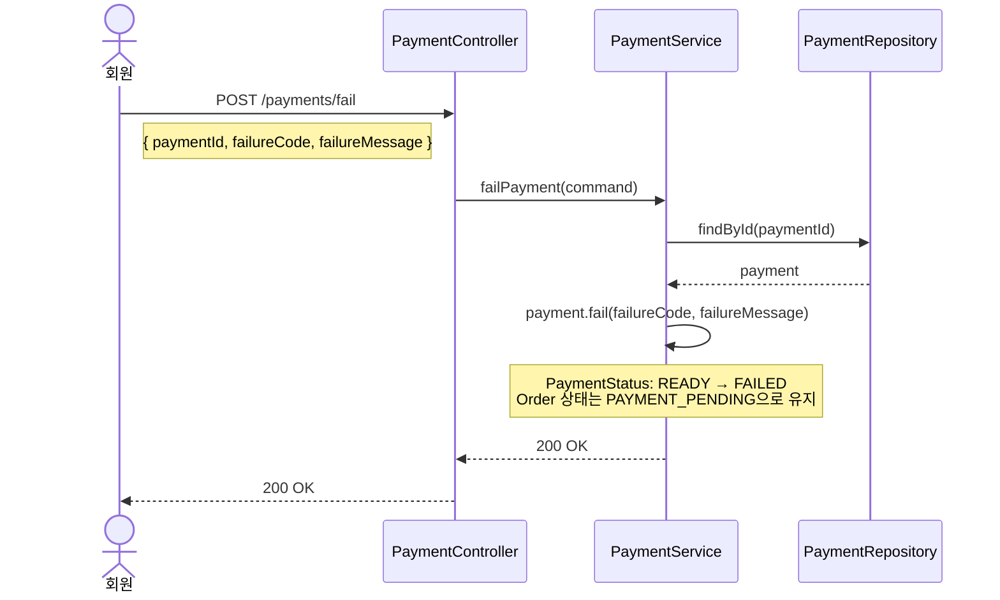
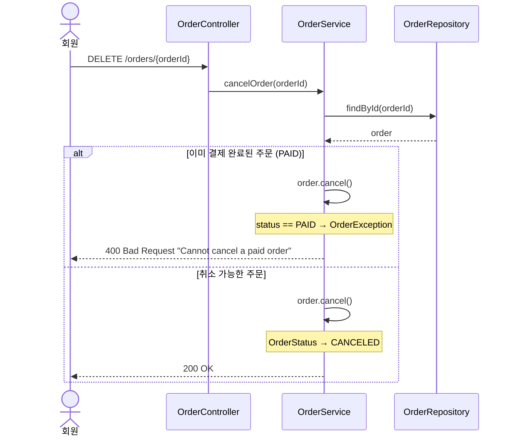

# 주문-결제 흐름 시퀀스 문서

> 현재 구현된 코드 기준으로 작성된 문서입니다.

이 문서는 현재 구현된 코드 기준으로 작성된 시스템 시퀀스 문서이며,
실제 운영 환경에서는 일부 설계가 변경될 수 있다.

---

## 1. 전체 흐름 개요

```
상품 등록 → 장바구니 담기 → 주문 생성 → 결제 요청 → 결제 승인 → 완료
```

---

## 2. 정상 흐름 (Happy Path)

### 2-1. 상품 등록



**핵심 규칙**
- 가격은 0보다 커야 함 → `ProductException` 발생
- 초기 상태는 항상 `ON_SALE`
- 재고가 0이 되면 자동으로 `OUT_OF_STOCK` 전환

---

### 2-2. 장바구니 담기



**핵심 규칙**
- 장바구니가 없으면 자동 생성 (`orElseGet`)
- 동일 상품 재담기 → 수량 합산
- 재고 초과 담기 → `CartException`
- 판매 중지 상품 담기 → `CartException`

---

### 2-3. 주문 생성



**핵심 규칙**
- 재고 차감은 주문 생성 시점에 즉시 발생 (개선 포인트 섹션 참고)
- `totalAmount`는 도메인 내부에서 자동 계산 (`recalculateTotalAmount`)
- 판매 중지 상품 포함 시 → `ProductException`
- 재고 부족 시 → `ProductException`

---

### 2-4. 결제 요청

결제는 다음 3단계로 구성된다. 현재 구현은 외부 PG 연동 대신 내부 상태 변경 방식으로 동작한다.

| 단계 | PaymentStatus | 설명 |
|------|---------------|------|
| 1. Payment 생성 | `READY` | 결제 객체 생성 (`POST /payments/request`) |
| 2. Payment 승인 요청 | `REQUESTED` | paymentKey 발급 (`POST /payments/confirm` 내부) |
| 3. Payment 승인 완료 | `APPROVED` | 최종 승인 완료 (`POST /payments/confirm` 완료) |



**핵심 규칙**
- 이미 결제된 주문 (`PAID`) → `OrderException`
- 취소된 주문 (`CANCELED`) → `OrderException`
- 상품 없는 주문 → `OrderException`

---

### 2-5. 결제 승인 (최종 완료)



---

## 3. 예외 흐름 (Exception Paths)

### 3-1. 재고 부족 (주문 생성 실패)



---

### 3-2. 판매 중지 상품 장바구니 담기 시도



---

### 3-3. 결제 실패



> **주의**: 현재 결제 실패 시 주문 상태는 `PAYMENT_PENDING`으로 남아있음.

**결제 실패 이후 가능한 행동:**
- **결제 재시도**: 동일 주문으로 `POST /payments/request` → `POST /payments/confirm` 재시도
- **주문 취소**: `DELETE /orders/{orderId}` 호출하여 주문 취소 처리

---

### 3-4. 주문 취소



---

## 4. 상태 전이 다이어그램

### OrderStatus

```
         주문 생성
CREATED ──────────────→ PAYMENT_PENDING ──────────→ PAID
   │                           │
   │ order.cancel()            │ order.cancel()
   ↓                           ↓
CANCELED                  CANCELED
```

| 상태 | 설명 | 허용 전이 |
|------|------|-----------|
| `CREATED` | 주문 생성 완료 | `PAYMENT_PENDING`, `CANCELED` |
| `PAYMENT_PENDING` | 결제 진행 중. 결제 성공 시 `PAID`, 결제 실패 시 재시도 또는 주문 취소 필요 | `PAID`, `CANCELED` |
| `PAID` | 결제 완료 | 전이 불가 |
| `CANCELED` | 취소됨 | 전이 불가 |
| `FAILED` | Reserved / Future use | - |

### PaymentStatus

```
READY ──────────→ REQUESTED ──────────→ APPROVED
                      │
                      │ payment.fail()
                      ↓
                    FAILED

APPROVED ──────────→ CANCELED (payment.cancel())
```

| 상태 | 설명 | 허용 전이 |
|------|------|-----------|
| `READY` | 결제 객체 생성 | `REQUESTED` |
| `REQUESTED` | 결제 키 발급 | `APPROVED`, `FAILED` |
| `APPROVED` | 결제 승인 완료 | `CANCELED` |
| `FAILED` | 결제 실패 | 전이 불가 |
| `CANCELED` | 결제 취소 | 전이 불가 |

---

## 5. API 엔드포인트 요약

| 단계 | Method | URL | 설명 |
|------|--------|-----|------|
| 상품 등록 | `POST` | `/products` | 상품 생성 |
| 상품 조회 | `GET` | `/products/{id}` | 상품 단건 조회 |
| 장바구니 조회 | `GET` | `/cart?memberId=` | 장바구니 조회 |
| 장바구니 담기 | `POST` | `/cart/items` | 상품 추가 |
| 수량 변경 | `PATCH` | `/cart/items/{productId}?memberId=` | 수량 변경 |
| 장바구니 삭제 | `DELETE` | `/cart/items/{productId}?memberId=` | 항목 삭제 |
| 주문 생성 | `POST` | `/orders` | 주문 생성 + 재고 차감 |
| 주문 조회 | `GET` | `/orders/{id}` | 주문 단건 조회 |
| 주문 취소 | `DELETE` | `/orders/{id}` | 주문 취소 |
| 결제 요청 | `POST` | `/payments/request` | 결제 객체 생성 (READY) |
| 결제 승인 | `POST` | `/payments/confirm` | 결제 승인 (REQUESTED → APPROVED) |
| 결제 실패 | `POST` | `/payments/fail` | 결제 실패 처리 (FAILED) |

---

## 6. 현재 구현의 한계 및 개선 포인트

| 항목 | 현재 | 개선 방향 |
|------|------|-----------|
| 재고 차감 시점 | 주문 생성 시 즉시 차감 | 결제 완료 후 확정 고려 |
| 결제 실패 시 주문 상태 | `PAYMENT_PENDING` 방치 | 자동 취소 또는 재시도 정책 필요 |
| 장바구니 → 주문 연동 | 수동으로 items 지정 | Cart 기반 자동 주문 생성 필요 |
| 인증/인가 | memberId를 파라미터로 전달 | JWT 기반 인증 도입 필요 |
| PG 연동 | paymentKey를 직접 입력 | 외부 PG 또는 Mock PG 연동 필요 |

### 재고 차감 전략

**현재 구현**
- 주문 생성 시 재고 차감 (`product.decreaseStock()`)

**문제점**
- 결제 실패 시 재고가 이미 차감된 상태로 유지됨
- 결제 취소 시 재고 복구 로직이 별도로 필요
- 동시에 여러 주문이 생성될 때 재고 정합성 문제 가능

**개선 방향**
- 결제 승인 후 재고 확정 (주문 생성 시에는 재고 예약만)
- 예약 재고(reserved stock) 개념 도입으로 실제 차감과 분리
- Event 기반 재고 처리: `PaymentConfirmedEvent` 수신 후 재고 확정

---

## 7. Event 기반 아키텍처 확장 가능성

현재 모놀리식 구조를 MSA로 확장할 때 이벤트 기반 구조로 발전 가능하다.

### 정의 가능한 이벤트

| 이벤트 | 발행 시점 | 주요 구독자 |
|--------|-----------|------------|
| `OrderCreatedEvent` | 주문 생성 완료 | Inventory, Notification |
| `PaymentConfirmedEvent` | 결제 승인 완료 | Inventory, Settlement, Notification |
| `PaymentFailedEvent` | 결제 실패 | Order (취소 처리), Notification |
| `OrderCanceledEvent` | 주문 취소 | Inventory (재고 복구), Payment (환불) |

### 이벤트 기반 확장 구조

```
클라이언트
    │
    ▼
Order Service ──────────────────────────────────────────────┐
    │ OrderCreatedEvent                                      │
    ▼                                                        │
Payment Service ─── PaymentConfirmedEvent ──┬───────────────┤
                                            │               │
                                            ▼               ▼
                                    Inventory Service   Settlement Service
                                    (재고 확정)          (정산 적재)
                                            │
                                            ▼
                                    Notification Service
                                    (구매 완료 알림)
```

**현재 → 이벤트 기반 전환 포인트**

```java
// 현재: 직접 호출 (강한 결합)
order.markPaid();  // PaymentService 내부에서 직접 Order 변경

// 개선: 이벤트 발행 (느슨한 결합)
eventPublisher.publish(new PaymentConfirmedEvent(orderId, amount));
// OrderEventListener → order.markPaid()
// InventoryEventListener → stock.confirm()
// SettlementEventListener → settlement.record()
```

---

## 8. Service Responsibility

Currently all responsibilities are implemented inside a single Spring Boot application.
However, the domain boundaries allow future separation into independent services in a Microservice Architecture.

| Service | Responsibility |
|---------|----------------|
| Catalog | Manage products and stock |
| Cart | Manage user cart items |
| Order | Create and manage order lifecycle |
| Payment | Handle payment request, approval, failure |
| Wallet (future) | Manage user balance and deductions |
| Settlement (future) | Calculate seller payouts and commissions |
